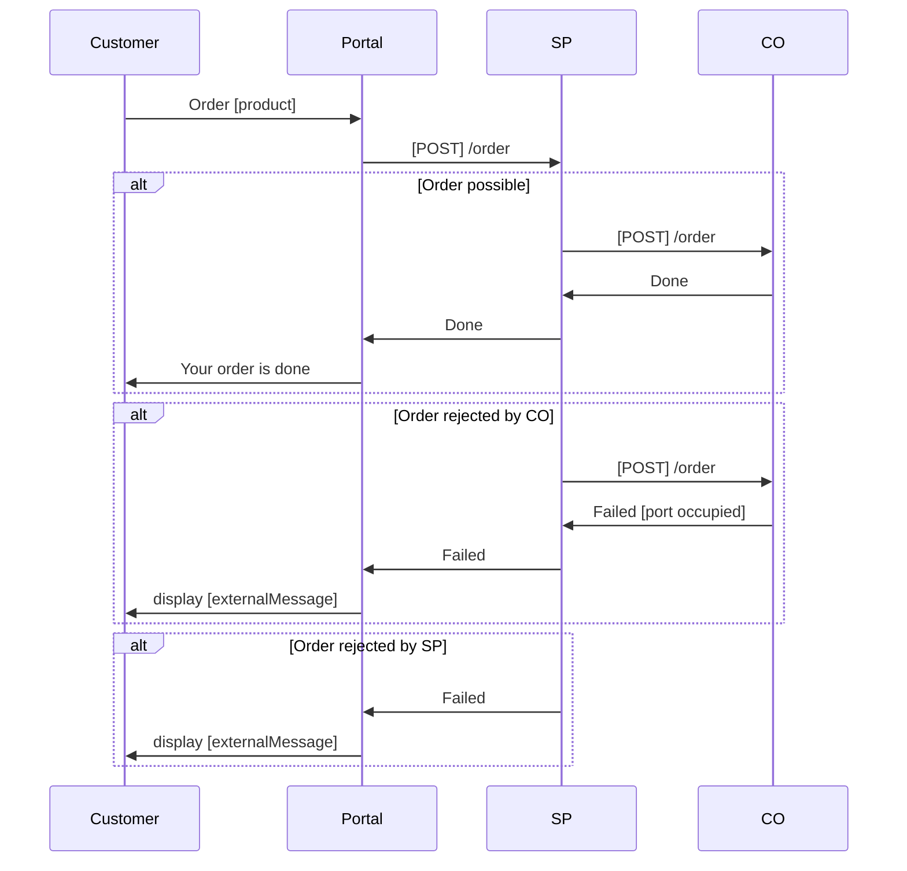

# Order

This API is used to order a product offering that the SP self activates in the CO network.

It is designed for external portals that never sends activation requests directly to the CO.

## Usage

The external portal captures the order details on a given access, including selected product offering and customer
information, and places an order request to the SP. The SP receives and validates the order and activates 
the CO transmission products in the CO network. The SP can also decide to reject the order, in which case 
the portal is able to present a relevant message to end customer.



## Request

```http
POST order/ HTTP/1.1
Content-Type: application/json
```

```json
{
  "coAccessId": "8732c2f065e2490babce820e94b1011a",
  "operation": "ACTIVATE",
  "orderDateTime": "2021-05-03T20:31:15Z",
  "requestedDateTime": "2021-05-06T00:01:00Z",
  "products": [
    {
      "productId": "8732c2f065e2490babce820e94b1011a",
      "offeringId": "8732c2f065e2490babce820e94b1011a"
    }
  ],
  "customerDetails": {
    "identifiedCustomer": true,
    "personalIdentityNumber": "string",
    "customerFirstname": "string",
    "customerLastName": "string",
    "customerPhone": "string",
    "customerMobilePhone": "string",
    "customerEmail": "string",
    "invoiceDetails": {
      "streetName": "string",
      "streetNumber": "string",
      "streetLittera": "string",
      "postalCode": "string",
      "city": "string"
    }
  }
}
```

### coAccessId

Identifies a single access in the CO population in the accesses API.

* Data format: [accessId](../common/dataformats.md#accessid)
* Mandatory

### operation

The type of operation this order is intended to perform.

* Data format: [enumeration](../common/dataformats.md#enumeration)
* Mandatory
* Only ACTIVATE is currently supported

**Values**

* ACTIVATE
    * Activation of transmission product

### orderDateTime

Date and time when the order was created.

* Data format: [dateTime](../common/dataformats.md#datetime)
* Mandatory

### requestedDateTime

Requested date and time for the order to be executed.

* Data format: [dateTime](../common/dataformats.md#datetime)
* Mandatory

### products

List of SP products and associated offerings. The model supports multiple activations for future extension, but
currently only allows a single product offering.

### products.productId

The unique ID of the base product provided by the SP. This ID identifies a unique product offering together with
products.offeringId.

* Data format: [id](../common/dataformats.md#id)
* Mandatory

### products.offeringId

The ID of the product offering provided by the SP. This ID identifies a unique product offering together with
products.productId.

* Data format: [id](../common/dataformats.md#id)
* Mandatory

### customerDetails

Customer details provided by the CO. This information should be validated by the SP.

* Data format: [customerDetails](../common/dataformats.md#customerdetails)
* Mandatory

## Response

```http
HTTP/1.1 200 OK Content-Type: application/json
```

```json
{
  "status": "ACTIVATED",
  "externalMessage": "Thanks for ordering. Your new service is now active. You will receive an email with order confirmation and information about how to get started."
}
```

### status

The status tells if the order is accepted or rejected.

* Data format: [enumeration](../common/dataformats.md#enumeration)
* Mandatory

**Values**

* ACTIVATED
    * Order is accepted and completed, and transmission products have been activated 
* RECEIVED
    * Order is accepted, but not yet completed
* REJECTED
    * Order is not accepted. The `externalMessage` should provide a relevant message that can be presented for the customer.

### externalMessage

Message that is intended for the customer.

Error handling according to [common responses](../common/responses.md)
