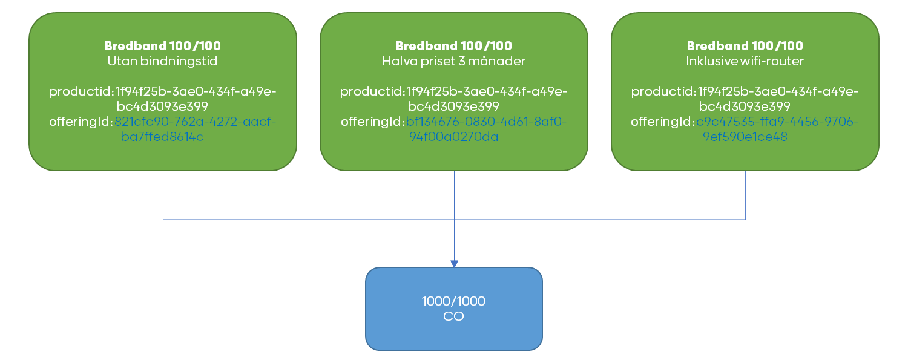

# Products

This API lists product offerings that are available to end customers and information about the service provider.

The definition of product offerings include campaigns as well as standard offerings.

* Allows the CO to periodically list all product offerings from SPs for publishing in portals
* Allows the CO to request product offerings on a specific access on-demand to ensure availability on that access


## Usage

The SP responds with a list of products and associated offerings, each associated to at least one CO product. The same CO transmission product 
can be used in multiple product offerings, and the same SP product can have multiple variants of offerings showing different prices and
conditions.

The product offerings structure is illustrated in the image below where "100/100" is offered in three different variants having the same base
productId but different offeringIds. Since offeringId can be used in multiple combinations of productId and 
offeringId, the CO must provide the combination of both when placing orders.



## Request

The request below is used to list all products and offerings made available by the SP in the CO network

```http
GET products/2.5/
Content-Type: application/json
```

Add the "accessId" from the CO accesses API to list offerings available on the specific access. 
The list shall only contain the offerings that the SP wants to deliver to the specific accessId. 

```http
GET products/[accessId]
Content-Type: application/json
```

Alternatively, the post method below can be used to list offerings on the specific access. When this endpoint is used, 
the CO has already performed a feasibility check and added the result in the request.

Given an array of CO transmission products, the service provider responds with a list of offerings 
available on the specific access. 

The "coProduct" is the same field as services/service specified in the CO endpoint [accesses API](../spec/accesses.md)

```http 
POST products/[accessId]
Content-Type: application/json
```

```
{
  "coProducts": 
  [
  	"10/10",
  	"100/10",
  	"100/100",
  	"250/100",
  	"250/250",
  	"500/100",
  	"500/500",
  	"1000/100",
  	"1000/1000"
  ]
}
```

Response:

```HTTP
HTTP/1.1 200 OK
Content-Type: application/json
```

```json
{
  "serviceProvider": {
    "phone": "013-212121",
    "openingHours": "07:00-16:00",
    "email": "acmeab@example.com",
    "website": "https://acmeab.example.com",
    "presentation": "Acme AB är en rikstäckande leverantör av höghastighetsinternet",
    "files": [
      {
        "type": "TermsAndConditions",
        "url": "http://example.com/allmannavilkor.pdf",
        "updated": "2007-04-05T14:30Z"
      },
      {
        "type": "PrivacyPolicy",
        "url": "http://example.com/integritetspolicy.pdf",
        "updated": "2007-04-05T14:30Z"
      },
      {
        "type": "Logo",
        "url": "http://example.com/logo_small.jpg",
        "updated": "2007-04-05T14:30Z"
      }
    ]
  },
  "products": [
    {
      "coProducts": [
        "100/100"
      ],
      "productId": "1f94f25b-3ae0-434f-a49e-bc4d3093e399",
      "marketingInformation": {
        "productName": "Bredband 100/100",
        "categories": [
          "internet"
        ],
        "description": "Bra snabbt Internet"
      },
      "files": [
        {
          "type": "TermsAndConditions",
          "url": "http://example.com/sarskildavilkor.pdf",
          "updated": "2007-04-05T14:30Z"
        },
        {
          "type": "Logo",
          "url": "http://example.com/logo_small.jpg",
          "updated": "2007-04-05T14:30Z"
        }
      ],
      "offerings": [
        {
          "offeringId": "821cfc90-762a-4272-aacf-ba7ffed8614c",
          "marketingInformation": {
            "offeringName": "Utan bindningstid",
            "consumerTypes": ["residential", "business"],
            "description": "Bra snabbt Internet utan bindingstid",
            "deliveryInformation": "Vi kontaktar dig om installation av CPE krävs",
            "startPrice": "0",
            "price": "250,50",
            "pricePeriod": "P1M",
            "periodOfNotice": "P1M",
            "agreementLength": "P1M"
          }
        },
        {
          "offeringId": "bf134676-0830-4d61-8af0-94f00a0270da",
          "marketingInformation": {
            "offeringName": "Halva priset 3 månader",
            "consumerTypes": ["residential", "business"],
            "description": "Första tre månaderna gratis, 12 månaders bindningstid",
            "priceGroups": [
              14,
              15,
              16
            ],
            "startPrice": "0",
            "price": "125",
            "pricePeriod": "P1M",
            "periodOfNotice": "P1M",
            "agreementLength": "P1Y",
            "campaignLength": "P3M",
            "basePrice": "250",
            "campaignCodes": [
              "billig",
              "hemlig"
            ],
            "campaign": true
          }
        },
        {
          "offeringId": "c9c47535-ffa9-4456-9706-9ef590e1ce48",
          "marketingInformation": {
            "name": "Inklusive wifi-router",
            "consumerTypes": ["residential"],
            "description": "Få en exklusiv router med abonnemanget för endast 25 kr mer i månaden, 3 månaders bindningstid",
            "startPrice": "0",
            "price": "275",
            "pricePeriod": "P1M",
            "periodOfNotice": "P1M",
            "agreementLength": "P3M",
            "valueAdded": "950"
          }
        }
      ]
    }
  ]
}
```

### serviceProvider

Object describing the service provider. The intended purpose is to allow portals to present the service provider and
show contact details.

### serviceProvider.phone

Phone number to sales or customer service.

* Data format: [text](../common/dataformats.md#text)
* Mandatory

### serviceProvider.openingHours

Regular opening hours when calls will be answered.

* Data format: [text](../common/dataformats.md#text)
* Optional
* Rules
* Times should be presented in the format HH:mm, e.g. "07:30", and the opening hours of a day include both a start and
  an end time separated by '-' as in "07:30-17:00"
* Optionally, opening hours can include the day of week, or indicate a span, e.g. "Monday 07:30-17:00" or "Monday-Friday
  07:30-17:00".
* Opening hours on different days of the week should be separated by ','.
* Special opening hours on weekends can be specified surrounded by parentheses, unless the day of the week is stated
  specifically, e.g. "07:30-17:00 (10:00-15:00)"

Examples: "07:30-17:00 (10:00-15:00)", "Monday-Friday 07:00-17:00, Saturday 09:00-13:00", "Monday-Thursday 07:00-17:00,
Friday 07:00-15:00"

### serviceProvider.email

Email address to sales or customer service.

* Data format: [text](../common/dataformats.md#text)
* Mandatory

### serviceProvider.website

The web address to the service provider pages.

* Data format: [text](../common/dataformats.md#text)
* Mandatory

### serviceProvider.presentation

Short presentation of the service provider.

* Data format: [text](../common/dataformats.md#text)
* Mandatory

### serviceProvider.files

Various files provided by the service provider that can be used by portals, e.g. images and documents.

* Data format: JSON array of [file](../common/dataformats.md#file)
* Mandatory

#### serviceProvider.files.type

The type of file

* Data format: enumeration
* Mandatory

**Valid values**

* TermsAndConditions - general terms and conditions that must be accepted by the customer
* PrivacyPolicy - privacy policy that must be accepted by the customer
* Logo - service provider logo image

#### serviceProvider.files.url

The full url to the file content

* Data format: [text](../common/dataformats.md#text)
* Mandatory

#### serviceProvider.files.updated

The datetime when the file was last updated (ISO-8601)

* Data format: [dateTime](../common/dataformats.md#datetime)
* Mandatory

## products

List of product relations between CO transmission products and SP end customer products

### products.coProducts

List of coProducts associated to the product offering relation. The model supports bundled offerings, but may not always
be supported by the CO, in which case these offerings will be discarded.

The "coProduct" is the same field as services/service specified in the CO endpoint [accesses API](../spec/accesses.md)

* Data format: JSON array of [text](../common/dataformats.md#text)
* Mandatory, must contain at least one item

### products.productId

The unique Id of the base product provided by the SP. This Id identifies a unique product offering together with
products.offerings.offeringId.

* Data format: [id](../common/dataformats.md#id)
* Mandatory

### products.marketingInformation

Contains common marketing information for all offerings in the relation. This information is intended to be presented to
customers.

* Mandatory

#### products.marketingInformation.productName

Name of the product

* Data format: [text](../common/dataformats.md#text)
* Mandatory

#### products.marketingInformation.categories

* Data format: list of enumeration
* Mandatory

Valid values

* internet
* tv
* telephony
* smarthome
* security

#### products.marketingInformation.description

Description of the product

* Data format: [text](../common/dataformats.md#text)
* Mandatory

### products.files

Various files provided by the service provider that can be used by portals, e.g. images and documents.

* Data format: JSON array of [file](../common/dataformats.md#file)
* Mandatory

#### products.files.type

The type of file

* Data format: enumeration
* Mandatory

**Valid values**

* TermsAndConditions - specific terms and conditions for the product that must be accepted by the customer
* Logo - product logo image

#### products.files.url

The full url to the file content

* Data format: [text](../common/dataformats.md#text)
* Mandatory

#### products.files.updated

The datetime when the file was last updated (ISO-8601)

* Data format: [dateTime](../common/dataformats.md#datetime)
* Mandatory

### products.offerings

List of product offering variants of the base product specified by productId

#### products.offerings.offeringId

The ID of the product offering provided by the SP. This ID identifies a unique product offering together with
products.productId. Note that offeringId may not be unique by itself.

* Data format: [id](../common/dataformats.md#id)
* Mandatory

#### products.offerings.marketingInformation

Contains marketing information for the specific product offering.

* Data format: [text](../common/dataformats.md#text)
* Mandatory

##### products.offerings.marketingInformation.offeringName

Name of the product offering. Used as subtitle to products.marketingInformation.productName.

* Data format: [text](../common/dataformats.md#text)
* Mandatory

##### products.offerings.marketingInformation.consumerTypes

* Data format: List of enumeration
* Mandatory

Valid values:

* residential
    * Individual customers
* business
    * Corporate customers
* student
* senior
* propertyOwner

##### products.offerings.marketingInformation.description

Description of the product offering

* Data format: [text](../common/dataformats.md#text)
* Mandatory

##### products.offerings.marketingInformation.priceGroups

List of price groups that this offering is available for. The offering will only be presented on accesses with a matching priceGroup. The value must be an integer, of which each value's price group is defined by CO. If omitted or empty, the offering is available on all accesses.

* Data format: JSON array of [integer](../common/dataformats.md#integer)
* Optional

##### products.offerings.marketingInformation.deliveryInformation

Information concerning delivery of the product offering

* Data format: [text](../common/dataformats.md#text)
* Optional

##### products.offerings.marketingInformation.startPrice

The one-time start price for the offering

* Data format: [price](../common/dataformats.md#price)
* Mandatory

##### products.offerings.marketingInformation.price

The recurring price for the offering

* Data format: [price](../common/dataformats.md#price)
* Mandatory

##### products.offerings.marketingInformation.pricePeriod

The duration of the recurring charge

* Data format: [duration](../common/dataformats.md#duration)
* Mandatory

##### products.offerings.marketingInformation.periodOfNotice

The notice period for cancellation

* Data format: [duration](../common/dataformats.md#duration)
* Mandatory

##### products.offerings.marketingInformation.agreementLength

The agreement length from the date of the delivery

* Data format: [duration](../common/dataformats.md#duration)
* Optional

##### products.offerings.marketingInformation.campaignLength

If products.offerings.marketingInformation.price indicates a time limited reduced price, this field shows the duration.
When campaign length is set, a value in basePrice is required.

* Data format: [duration](../common/dataformats.md#duration)
* Optional

##### products.offerings.marketingInformation.basePrice

If products.offerings.marketingInformation.price indicates a time limited reduced price, this field shows the base price
charged after campaignLength.

* Data format: [price](../common/dataformats.md#price)
* Optional (Mandatory if campaignLength is set)

##### products.offerings.marketingInformation.campaignCodes

List of campaign codes required for ordering this product offering

* Data format: JSON array of [text](../common/dataformats.md#text)
* Optional

##### products.offerings.marketingInformation.campaign

Indicates if this product offering should be handled as a campaign which may affect the presentation in portals

* Data format: [boolean](../common/dataformats.md#boolean)
* Mandatory

##### products.offerings.marketingInformation.valueAdded

Shows the added value of the offering for any extra services or benefits, e.g. higher speed or premium router. May be
required by law in some countries.

* Data format: [price](../common/dataformats.md#price)
* Optional
