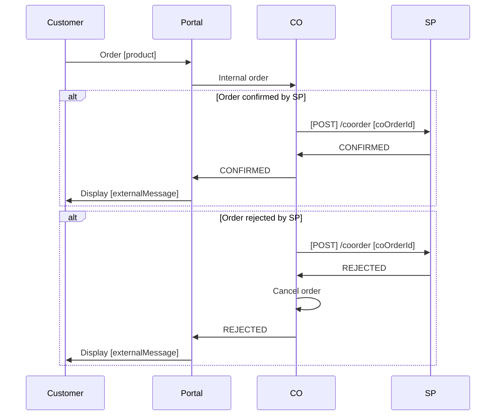

# CO Order

This endpoint is intended to be used by the CO to send an order for approval to the SP before connecting the transmission
products.

## Usage

The CO captures the order details on a given access, including selected product offering and customer information, and
sends a CO order request to the SP. The SP validates the order and customer and either rejects or confirms the order. 

Depending on the results, the CO will present relevant feedback to the customer.



## Request

```http
POST /onapi/2.6/coorder/ HTTP/1.1
Content-Type: application/json
```

```json
{
  "coOrderId": "f3f26446f6e8407aae876ea8e52d7417",
  "coAccessId": "3d663ca5-9020-415c-9412-53282b168738",
  "operation": "ACTIVATE",
  "orderDateTime": "2021-05-03T20:31:15Z",
  "requestedDateTime": "2019-02-05T00:00:00Z",
  "products": [
    {
      "productId": "1f94f25b-3ae0-434f-a49e-bc4d3093e399",
      "offeringId": "821cfc90-762a-4272-aacf-ba7ffed8614c",
      "coProduct": "100/100",
      "coSubscriptionId": "2e450f9b-b1ca-4300-b8a2-451f007af85f"
    }
  ],
  "customerDetails": {
    "identifiedCustomer": true,
    "personalIdentityNumber": "string",
    "organizationNumber": "string",
    "organizationName": "string",
    "firstName": "string",
    "lastName": "string",
    "phone": "string",
    "mobilePhone": "string",
    "email": "string",
    "invoiceDetails": {
      "streetName": "string",
      "streetNumber": "string",
      "streetLittera": "string",
      "postalCode": "string",
      "city": "string"
    }
  }
}
```

## coOrderId

The unique ID of the order on the CO side.

* Data format: [id](../common/dataformats.md#id)
* Required in request

## coAccessId

Identifies a single access point in the CO population in the accesses endpoint.

* Data format: [accessId](../common/dataformats.md#accessid)
* Mandatory

## operation

The type of operation this order is intended to perform.

* Data format: [enumeration](../common/dataformats.md#enumeration)
* Required in request
* Only ACTIVATE is currently supported

**Values**

* ACTIVATE
    * Activation of transmission product

## state

The status of the order

* Data format: [enumeration](../common/dataformats.md#enumeration)
* Required in response

**Values**

* CONFIRMED
    * The SP confirms the order
* REJECTED
    * The SP rejects the order

## orderDateTime

Requested date and time when the order was created in the CO system

* Data format: [dateTime](../common/dataformats.md#datetime)
* Mandatory

## requestedDateTime

Requested date and time for the order to be executed

* Data format: [dateTime](../common/dataformats.md#datetime)
* Mandatory

## products

List of SP products and associated offerings. The model supports multiple activations for future extension, but
currently only allows a single product offering.

### products.productId

The unique ID of the base product provided by the SP. This ID identifies a unique product offering together with
products.offeringId.

* Data format: [id](../common/dataformats.md#id)
* Mandatory

### products.offeringId

The ID of the product offering provided by the SP. This ID identifies a unique product offering together with
products.productId.

* Data format: [id](../common/dataformats.md#id)
* Mandatory

### products.coProduct

The CO product that the CO has matched to the SP product and offering and that will be activated as a result of this
order. It is recommended that the SP validates that this match is correct.

* Data format: JSON array of [text](../common/dataformats.md#text)
* Optional

### products.coSubscriptionId

Reference to the subscription on CO side. If it is not set, the SP will receive this later when order has been handled.
It may however be required in case coOrderId is set if the subscription have already been created on the CO side.

* Data format: [subscriptionId](../common/dataformats.md#subscriptionid)
* Optional

## customerDetails

Customer details provided by the CO. This information should be validated by the SP.

* Data format: [customerDetails](../common/dataformats.md#customerdetails)
* Mandatory

## Responses

```HTTP
HTTP/1.1 200 OK
Content-Type: application/json
```

```json
{
  "state": "CONFIRMED",
  "externalMessage": "Thanks for ordering. You will receive an email with order confirmation and information about how to get started.",
  "cause": "",
  "spReference": "f3ae2df8-40ae-4cb5-9b52-c9c1dd32020d",
  "products": [
    {
      "productId": "1f94f25b-3ae0-434f-a49e-bc4d3093e399",
      "offeringId": "821cfc90-762a-4272-aacf-ba7ffed8614c",
      "spSubscriptionId": "d02925f0083b4f64993b365accfbb1ac"
    }
  ]
}
```

### externalMessage

Message that is intended for the customer

* Required in response

### cause

Message that is intended for the CO only. Can always be provided for logging purposes.

### spReference

The unique reference to the customer on the SP side

* Data format: [spReference](../common/dataformats.md#spreference)
* Mandatory if state is CONFIRMED

#### products.spSubscriptionId

The unique reference to the subscription on the SP side

* Data format: [spSubscriptionId](../common/dataformats.md#spsubscriptionid)
* Mandatory if state is CONFIRMED

Error handling should use HTTP status codes, and optionally set the "cause" field to communicate what went wrong. If the
server has an ID of the error (such as a fault number or, even better, a ticket ID) it should be included in the cause
field. The message included in the "cause" field must never be displayed to the customer, but it may be logged on the CO
system.

Anything else than status 200 will result in an immediate cancellation of the order, and only the "cause" field is
allowed. This should be seen as an exception, and a generic error message should be presented for the customer.

Status 200 should always be returned as long as the order message itself is correct, mandatory fields are supplied, and
the message can be parsed and handled in a managed way, and there is nothing specific in the error that is not suitable
to present to the customer.

For instance, if there are any mandatory information missing in the customer details that the order capture portal would
be assumed to validate and prevent, this should result in status 400. On the other hand, if the customer cannot be
accepted because the credit check fails, this should be communicated to the customer in an informative way.

Example 1 (invalid data):

```http
HTTP/1.1 400 Bad Request
Content-Type: application/json
```

```json
{
  "cause": "Invalid offeringId: bf134676-0830-4d61-8af0-94f00a0270da"
}
```

Example 2 (whoops, something went wrong):

```http
HTTP/1.1 500 Internal Server Error
Content-Type: application/json
```

```json
{
  "cause": "Unknown error has occurred. Error number 12345."
}
```

Example 3 (offering not available):

```HTTP
HTTP/1.1 200 OK
Content-Type: application/json
```

```json
{
  "state": "REJECTED",
  "externalMessage": "We are sorry, but the selected offering is no longer available on your location. Please contact us for more information and alternatives."
}
```

Error handling according to [common responses](../common/responses.md)
